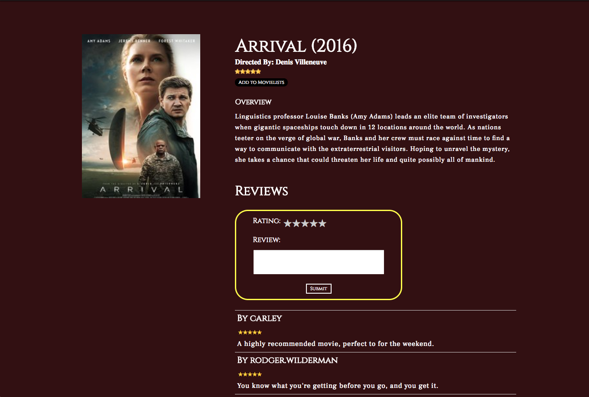

# Flash Flicks
Flash Flicks is a web application inspired from 'Goodreads'. Users can search
for movies and catalogue them into their movie lists.

[Live Site](https://flashflicks.herokuapp.com/#/)

## Technology
Flash Flicks was built with Rails and React/Redux.

## Features
- Create User accounts
- Users can add Movies to Movie Lists and view a particular movie.

## Features for the Future
- Users can add movies that are not available already.
- Search Bar
- Personalize User accounts
- Home page can be sorted by ratings or most viewed
