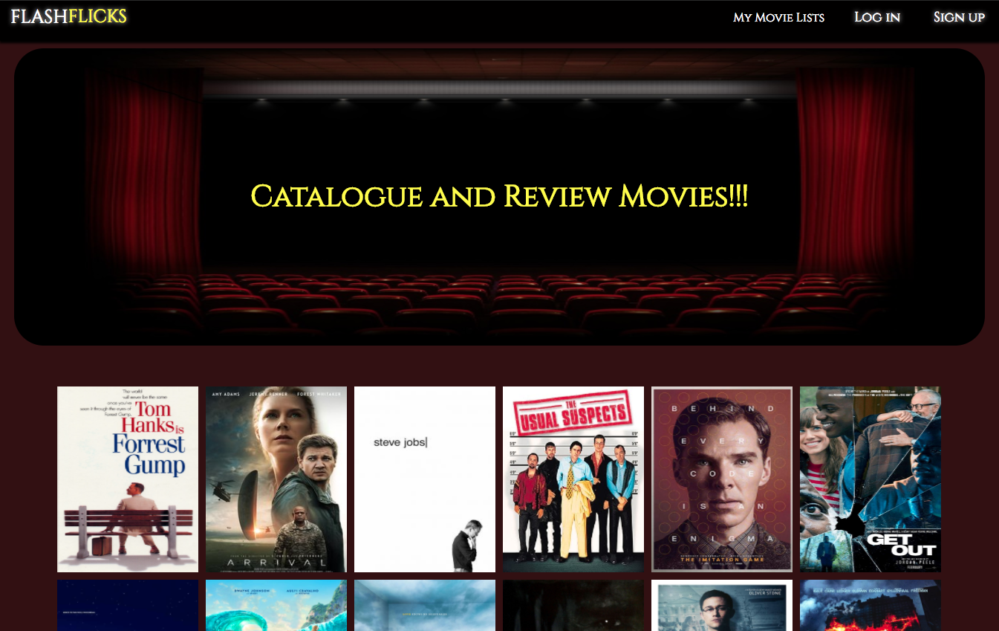

# Flash Flicks
Flash Flicks is a web application inspired from 'Goodreads'. Users can search
for movies and catalogue them into personal movie lists.

[Live Site](https://flashflicks.herokuapp.com/#/)

## Technology
Flash Flicks uses the React.js framework and follows the Redux architecture.  
The backend uses a Ruby on Rails architecture with JSON requests sent by a
react-redux frontend.  

- React.js
- Redux
- jQuery
- Ruby on Rails
- Active Record
- PostgreSQL
- Bcrypt
- Heroku Server 

## Features
- Securely authenticated User Accounts
- Add Movies to Movie Lists and view any particular movie.
- Review Movies

## Features for the Future
- Users can add movies that are not available already.
- Search Bar
- Home page can be sorted by ratings or most viewed
